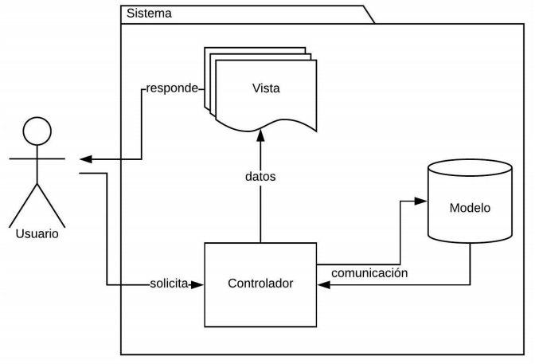
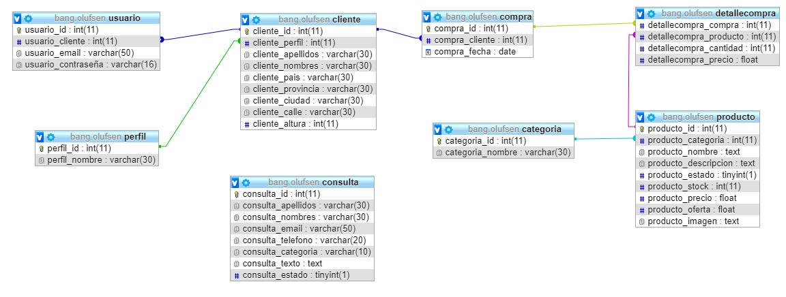
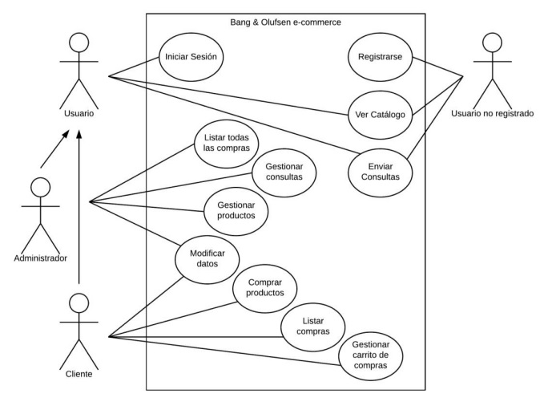

Taller de Programación I - 2019

Licenciatura en Sistemas de Información

UNNE - FaCENA

---

**Profesor**: Alfonzo, Pedro

**Proyecto**: Bang & Olufsen e-commerce

**Alumno**: Aguirre, Gonzalo Adolfo

# Especificación de requerimientos

## Introducción

La presente Especificación de requerimientos de software (SRS) de la Aplicación web a construir surge para ser un conjunto de información necesaria que ayuda a los desarrolladores del software a analizar y entender todos los requisitos y requerimientos que nuestro cliente desea, de la misma forma como este constituye un informe útil para que el cliente del producto final describa lo que el realmente desea obtener, y de esta manera lograr tener un documento necesario cuya información en el futuro servirá para el desarrollo del software, es decir en la codificación correcta del mismo. Se describirá en forma detallada las interfaces de usuario, de software y comunicaciones, así como de los requerimientos del cliente, atributos del sistema entre otros.

### Propósito

- Describir en forma completa el comportamiento del sistema a desarrollar, detallando las interacciones que tendrán los usuarios del software.
- Permite establecer las bases de acuerdo entre usuarios administradores y clientes.

### Alcance

- El futuro sistema es una Aplicación web de e-commerce para la marca Bang & Olufsen.
- Objetivos del Sistema
  - Posibilitar la compra de productos a usuarios registrados.
  - Administración de catálogo de productos.
  - Gestión de consultas de clientes.

### Definiciones, acrónimos y abreviaturas

**Aplicación web**: una aplicación o herramienta informática accesible desde cualquier navegador.

**e-commerce**: comercio electrónico valiéndose de internet como medio para comercializar.

**Usuario**: persona que tiene al acceso al sistema mediante una cuenta.

**Administrador**: usuario con acceso a las funciones de la gestión del e-commerce.

**Cliente**: usuario con la posibilidad de comprar los productos de la web.

**MVC**: patrón de arquitectura de software que separa los datos y la lógica de negocio de una aplicación de su representación y el módulo encargado de gestionar los eventos y las comunicaciones.

## Descripción general

### Perspectiva del producto

- El sistema que se va a desarrollar es independiente, y seguirá el patrón de arquitectura de software MVC.

### Funcionalidad del producto

El sistema permitirá realizar distintas funcionalidades según quien lo utilice.

Administrador:

- Alta, modificación y baja lógica de productos.
- Visualización de un listado de productos por categorías.
- Listar las consultas por pendientes y realizadas.
- Hacer un seguimiento de las ventas.

Cliente:

- Realizar la compra del carrito.
- Agregar y quitar productos del carrito de compras.
- Modificar los datos del usuario.

Usuario no registrado:

- Visualizar un catálogo de productos, filtrarlo por categoría.
- Ver una lista de productos con ofertas.
- Buscar productos por nombre y/o descripción.
- Registrar e Inicio de Sesión.
- Enviar una consulta.

### Características de los usuarios

| Tipo de usuario | Formación (nivel educativo) | Experiencia y Especialización técnica                                                         |
| --------------- | --------------------------- | --------------------------------------------------------------------------------------------- |
| Administrador   | Educación secundaria        | Conocimientos de informática y marketing; y experiencia con programas de gestión de productos |
| Cliente         | No especificado             | No especificado                                                                               |
| No registrado   | No especificado             | No especificado                                                                               |

### Restricciones

Las páginas serán escritas en HTML5, JavaScript y CSS con el framework Bootstrap. La parte funcional estará desarrollada en PHP en el framework CodeIgniter. Y para la base de datos se utilizará MySQL.

### Suposiciones y dependencias

Al ser una aplicación web los usuarios necesitarán de una computadora con acceso a Internet que posea instalado un navegador web.

## Requisitos específicos

### Requisitos funcionales

| Nº de requisito | Descripción del requisito                                                                         |
| --------------- | ------------------------------------------------------------------------------------------------- |
| RF#01           | El sistema debe permitir el inicio de sesión.                                                     |
| RF#02           | El sistema debe permitir el registro de nuevos usuarios.                                          |
| RF#03           | El sistema debe permitir la modificación de los datos personales,                                 |
| RF#04           | El sistema debe permitir la visualización de compras anteriores.                                  |
| RF#05           | El sistema debe permitir la búsqueda de producto por nombre y/o descripción.                      |
| RF#06           | El sistema debe permitir la visualización de productos posibles para la compra (catálogo).        |
| RF#07           | El sistema debe permitir filtrar el catálogo por categoría.                                       |
| RF#08           | El sistema debe permitir mostrar solo los productos con oferta.                                   |
| RF#09           | El sistema debe permitir mostrar los términos de uso de la página.                                |
| RF#10           | El sistema debe permitir mostrar los términos de comercialización de la página.                   |
| RF#11           | El sistema debe permitir mostrar una página con información de la empresa.                        |
| RF#12           | El sistema debe permitir mostrar un listado de los productos de la base de datos.                 |
| RF#13           | El sistema debe permitir registrar un nuevo producto.                                             |
| RF#14           | El sistema debe permitir modificar los productos existentes.                                      |
| RF#15           | El sistema debe permitir realizar la baja lógica de un producto.                                  |
| RF#16           | El sistema debe permitir visualizar una lista de todas las ventas realizadas mediante el sistema. |
| RF#17           | El sistema debe permitir filtrar la lista de ventas por fechas,                                   |
| RF#18           | El sistema debe permitir enviar consultas a los administradores de la página.                     |
| RF#19           | El sistema debe permitir ver las consultas recibidas                                              |
| RF#20           | El sistema debe permitir modificar el estado de las consultas disponibles.                        |

### Requisitos no funcionales

#### Requisitos del producto

| Nº de requisito | Descripción del requisito                                     | Clasificación |
| --------------- | ------------------------------------------------------------- | ------------- |
| RNF#01          | El sistema debe responsivo utilizando el framework Bootstrap. | Usabilidad    |
| RNF#02          | El sistema debe cargarse en no más de cinco segundos.         | Rapidez       |

#### Requisitos organizacionales

| Nº de requisito | Descripción del requisito                                       | Clasificación  |
| --------------- | --------------------------------------------------------------- | -------------- |
| RNF#03          | El sistema debe terminarse en cuatromeses.                      | Entrega        |
| RNF#04          | El sistema debe ser desarrollado bajo el framework CodeIgniter. | Implementación |

#### Requisitos externos

| Nº de requisito | Descripción del requisito                                           | Clasificación             |
| --------------- | ------------------------------------------------------------------- | ------------------------- |
| RNF#05          | El sistema debe proteger los datos personales de los usuarios.      | Legislativos - Privacidad |
| RNF#06          | El sistema no debe permitir a un usuario realizar compras por otro. | Legislativos - Seguridad  |

## Diagramas del Sistema

### Modelado de la Base de Datos

### Diagramas de Caso de Uso

